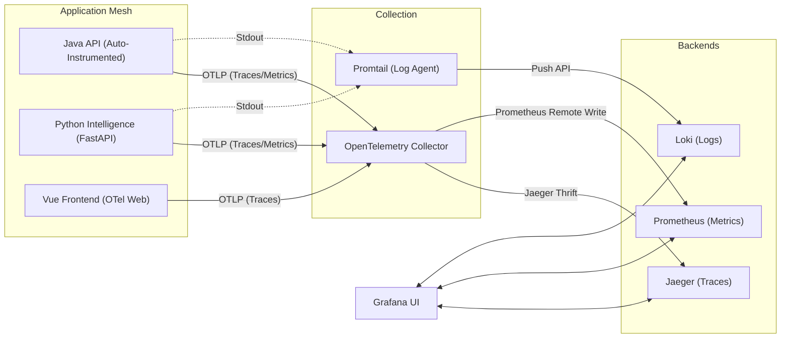

# Observability Architecture (The "LGTM" Stack)

This document outlines the observability strategy for the Utility Explorer platform. We utilize the **LGTM** stack (Loki, Grafana, Tempo/Jaeger, Mimir/Prometheus) to provide a unified view of Logs, Metrics, and Traces across our distributed services.

## 1. Goal
To answer the three critical questions of production debugging:
- **Tracing**: "Where did the request break?" (Distributed Context)
- **Metrics**: "Is the system healthy?" (Trends & Alerts)
- **Logs**: "What exactly happened?" (Detailed Events)

## 2. Architecture Overview

All observability data is visualized centrally in **Grafana**.

### A. The Stack (Running in Docker)

| Component | Role | Description |
|-----------|------|-------------|
| **Grafana** | Visualization | The "Single Pane of Glass". Queries all other backends to build dashboards. |
| **Jaeger** | Tracing Backend | Stores and visualizes distributed traces (Request timelines). *Note: We use OpenTelemetry for collection.* |
| **Prometheus**| Metrics DB | Time-series database that scrapes metrics (CPU, Memory, Request Counts) from services. |
| **Loki** | Logging DB | "Prometheus for Logs". Index-free log aggregation that correlates efficiently with Grafana. |
| **Promtail** | Log Shipper | Reads Docker container logs and ships them to Loki. |
| **OTel Collector** | Telemetry Hub | A central receiver that accepts Traces/Metrics from apps and exports them to Jaeger/Prometheus. |

### B. Data Flow

## 3. Implementation Details

### A. Tracing (The "Story")
We use **OpenTelemetry (OTel)** to generate traces.
- **Trace Context Propagation**: A unique `TraceID` is generated at the UI or API Gateway. It is passed via HTTP Headers (`traceparent`) to the Python Service and via Kafka Headers to the Ingestion Service.
- **Instrumentation**:
    - **Java**: Automatic via `opentelemetry-javaagent.jar` (Zero code changes).
    - **Python**: Library instrumentation (`opentelemetry-instrumentation-fastapi`).

### B. Metrics (The "Pulse")
- **Java**: Spring Boot Actuator exposes `/actuator/prometheus`.
- **Python**: Prometheus client allows scraping.
- **System**: Prometheus can also scrape container stats (CPU/RAM).

### C. Logging (The "Details")
- **Loki** is the chosen solution for local Docker meshes. 
- It avoids the heavy resource usage of Elasticsearch (ELK Stack).
- **Log Correlation**: By injecting the `TraceID` into the log lines, Grafana will allow us to click a "Trace" and instantly see the "Logs" for that specific request.

## 4. Developer Experience
Once deployed (Story 7), you will access:
- **Grafana**: `http://localhost:3000` (User: `admin/admin`)
- **Jaeger UI**: `http://localhost:16686` (Direct trace view, if needed)

## 5. Deployment Plan (Stories 7 & 8)
1.  **Infrastructure**: Update `docker-compose.yml` to include the verified config for Jaeger, Prometheus, Loki, Promtail, and Grafana.
2.  **Instrumentation**:
    - Build `api` and `ingestion` with the OTel Java Agent.
    - Update `intelligence` requirements to include OTel libs.
    - Configure `otel-collector-config.yaml`.
